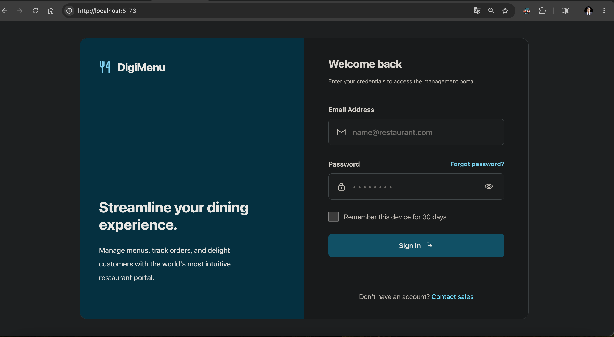
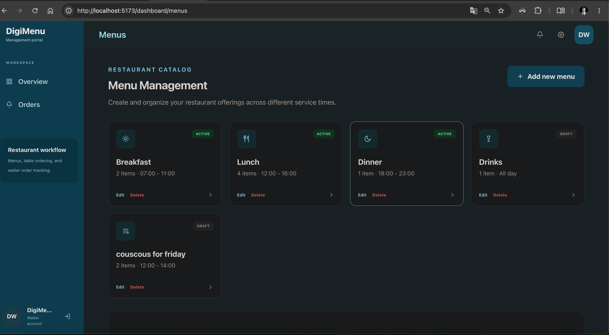
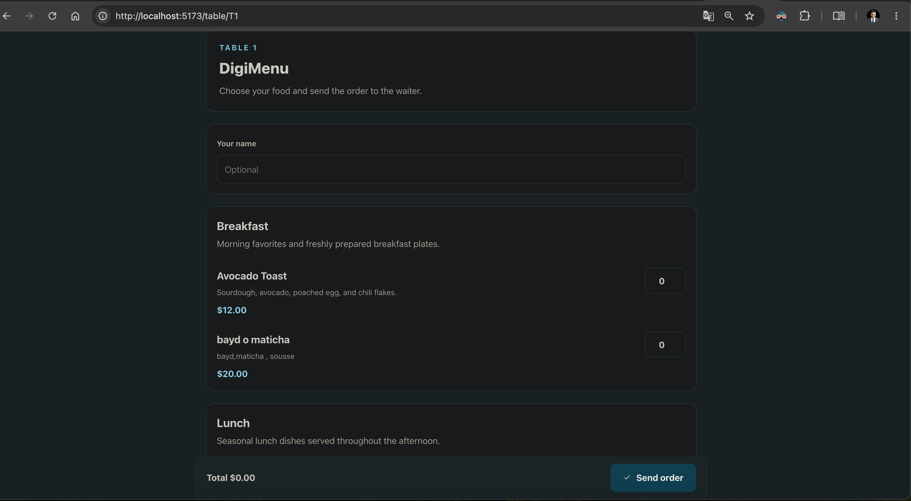
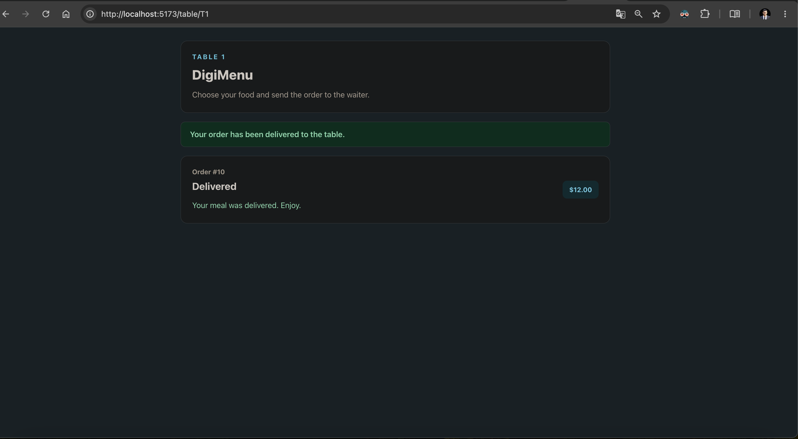
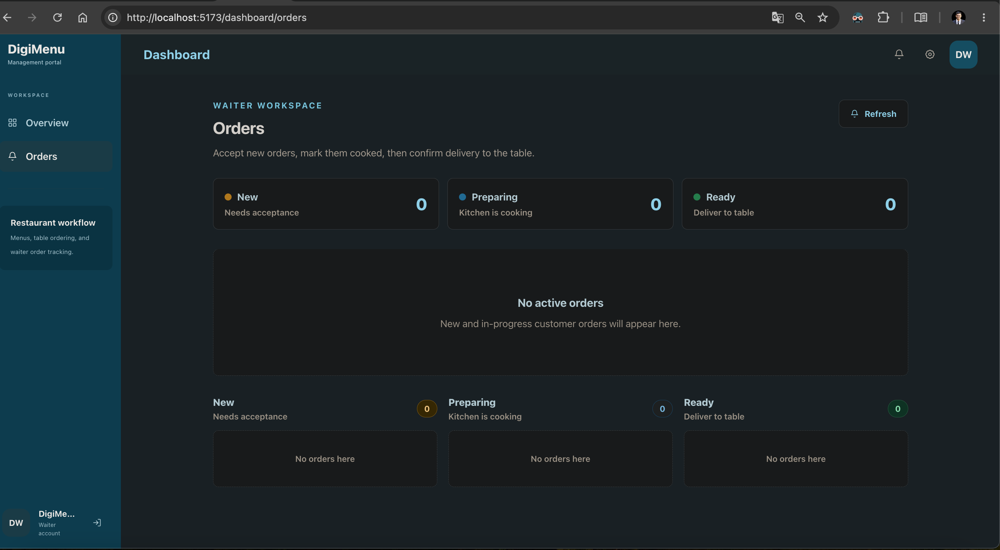

# DigiMenu

DigiMenu is a full-stack web application for restaurants to manage digital menus, receive table orders, and track order progress from the waiter dashboard.

The application allows restaurant staff to create menus, add menu items, update prices, manage product availability, and organize items by menu. Customers can browse the restaurant's digital menu from a table page, choose items, and send the order to the waiter.

## Prototype Screenshots

### Login page

### Menu management

### Customer table menu

### Order delivered state

### Waiter orders dashboard

## Current Scope

- Staff authentication
- Menu and menu item management
- Public table menu page
- Customer order submission
- Waiter order tracking dashboard

Future versions can add QR code generation, richer table management, customer visits, kitchen roles, reviews, and analytics.
